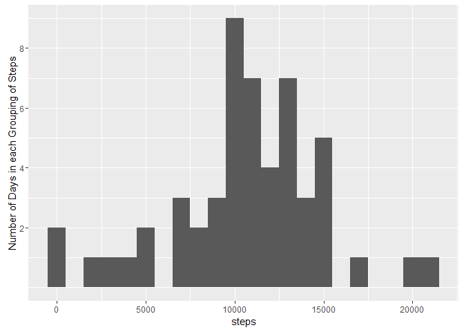
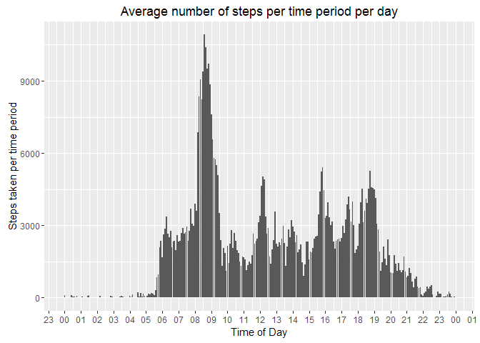
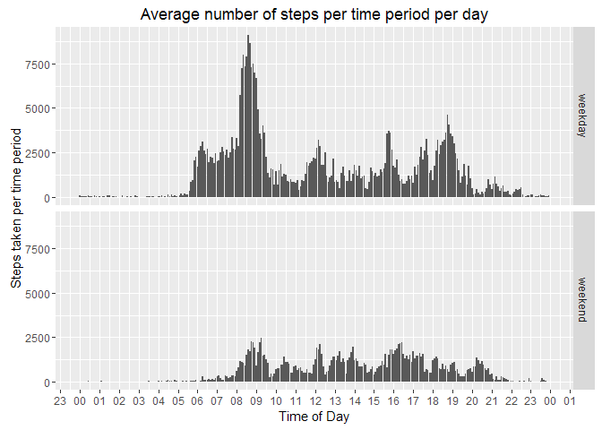

# Reproducible Research: Peer Assessment 1
## Introduction

It is now possible to collect a large amount of data about personal movement using activity monitoring devices such as a Fitbit, Nike Fuelband, or Jawbone Up. These type of devices are part of the “quantified self” movement – a group of enthusiasts who take measurements about themselves regularly to improve their health, to find patterns in their behavior, or because they are tech geeks. But these data remain under-utilized both because the raw data are hard to obtain and there is a lack of statistical methods and software for processing and interpreting the data.

This assignment makes use of data from a personal activity monitoring device. This device collects data at 5 minute intervals through out the day. The data consists of two months of data from an anonymous individual collected during the months of October and November, 2012 and include the number of steps taken in 5 minute intervals each day.

## Loading and preprocessing the data
There are some global options that I'd like to set so I don't have to set them in each code chunk.


```r
knitr::opts_chunk$set(echo=TRUE, warning=FALSE)
# knitr::opts_chunk$set(echo=FALSE, warning=FALSE)
```

That being done, now load the required libraries.

```
## 
## Attaching package: 'dplyr'
```

```
## The following objects are masked from 'package:stats':
## 
##     filter, lag
```

```
## The following objects are masked from 'package:base':
## 
##     intersect, setdiff, setequal, union
```

```
## 
## Attaching package: 'lubridate'
```

```
## The following object is masked from 'package:base':
## 
##     date
```

Read in the data file. I don't want to waste computing power by unzipping the file multiple times so check to see if there is an unzipped copy of the file before reading it in. If not, unzip the file and then read it in to a variable called `df`. 


```r
# Define the names of the zip file and the unzipped data file.
df.zip <- "./data/activity.zip"
df.csv <- "./data/activity/activity.csv"

# Check to see if the file has been unzipped and, if not, unzip it.
if (!file.exists(df.csv)) { 
    unzip(df.zip)
}

# Load the data
df <- read.csv(df.csv, header = TRUE, sep = ",", stringsAsFactors = FALSE)
```

Now that the data has been read in, I will run a number of pre-processing steps to get the data into a usable format. The first thing to do is to create a datatime variable which is a concatenation of the `df$date` and `df$interval` variables. To do this I will:

1. Use the dplyr::mutate() function to:  
    * Pad the `df$interval` string out to a fixed width of 4 characters.  
    * Concatenate that with the date variable to make a `df$datetime` variable.
    * Converte the `df$datetime` variable to POSIXct format. 
1. Group by the `df$date` field.  

I had to use POSIXct because DPLYR doesn't play nicely (at all) with POSIXlt for some reason and comes up with this error: Error: Date/times must be stored as POSIXct, not POSIXlt.


```r
df <- df %>%
    mutate(interval = formatC(interval, width = 4, format = "d", flag = "0"),
           datetime = paste(date, interval, sep = " "),
           datetime = as.POSIXct(strptime(datetime, "%Y-%m-%d %H%M"))) %>%
    group_by(date)
```

## What is mean total number of steps taken per day?

Just to be clear here, I've taken this to mean per individual day and not per Monday, Tuesday, etc. I've used the `aggregate()` function to sum the number of steps taken each day and assigned that to a variable called `spd` (short for "Steps Per Day").


```r
spd <- aggregate(steps ~ date, df, sum)
```

Now plot this data as a histogram.

```r
q1.plot <- ggplot(spd, aes(steps)) + 
    geom_histogram(binwidth = 1000) +
    scale_y_continuous(name = "Number of Days in each Grouping of Steps", 
                       breaks = seq(2, 10, 2))
print(q1.plot) 
```

<!-- -->

The final part of this question is to calculate the mean and median of the total number of steps per day. This can be done in two ways. Either calculate these values individually as follows:


```r
mean(spd$steps, na.rm = TRUE)
```

```
## [1] 10766.19
```

```r
median(spd$steps, na.rm = TRUE)
```

```
## [1] 10765
```

Or, simply use the summary() function to do the calculations in one step.


```r
summary(spd$steps)
```

```
##    Min. 1st Qu.  Median    Mean 3rd Qu.    Max. 
##      41    8841   10760   10770   13290   21190
```

There are slight differences in the answers between these two methods. That's for another investigation though.

## What is the average daily activity pattern?

1. Make a time series plot (i.e. type = "l") of the 5-minute interval (x-axis) and the average number of steps taken, averaged across all days (y-axis).

Start by aggregating the data by interval. I want all time periods to be compressed to the equivalent of a single day so I create a new time of day variable (`tod`) that is a fixed day + the `interval` variable concatenated together and converted to `POSIXct` format. I specifically chose this format because I can use date manipulation in ggplot to format the plot better.  
This data is then summarised using the `aggregate()` function.


```r
df$tod <- as.POSIXct(strptime(paste("2016-12-25", df$interval, sep = " "), 
                              format = "%Y-%m-%d %H%M",
                              tz = "Australia/Adelaide") )
q2.data <- aggregate(steps ~ tod, df, sum)
```

Now that we have a POSIXct date and the sum of the steps taken at that time of the day we can now plot the data:


```r
q2.plot <- ggplot(q2.data, aes(tod, steps)) + 
    geom_bar(stat = "identity") + 
    scale_x_datetime(date_breaks = "1 hour",
                     labels = date_format("%H", tz = "Australia/Adelaide")) +
    xlab("Time of Day") + 
    ylab("Steps taken per time period") +
    ggtitle("Average number of steps per time period per day")
print(q2.plot)
```

<!-- -->

2. Which 5-minute interval, on average across all the days in the dataset, contains the maximum number of steps?

For this I use the `which.max()` function to retrieve the row with the maximum value in the dataset.


```r
q2.data$tod[which.max(q2.data$steps)]
```

```
## [1] "2016-12-25 08:35:00 ACDT"
```

The 5-minute interval which, on average, has the highest number of steps is 8:35am.

## Imputing missing values

For this I will take the mean value for the equivalent time interval and use that value. Let's start by seeing how many missing value's there are in the original data set.


```r
sum(is.na(df$steps))
```

```
## [1] 2304
```

We already have calculated the mean for each time interval in the last question so we can now apply that to a copy of the data frame (so we keep the original values intact). This is done using an inner join between q3.data and q2.data joining on the time-of-day (`tod`) variable.


```r
q3.data <- df

q3.imputed <- inner_join(q3.data, 
               q2.data, 
               by ="tod") %>% 
    mutate(steps=ifelse(is.na(steps.x), steps.y, steps.x)) %>%
    select(date,interval,steps)
head(q3.imputed)
```

```
## Source: local data frame [6 x 3]
## Groups: date [1]
## 
##         date interval steps
##        <chr>    <chr> <int>
## 1 2012-10-01     0000    91
## 2 2012-10-01     0005    18
## 3 2012-10-01     0010     7
## 4 2012-10-01     0015     8
## 5 2012-10-01     0020     4
## 6 2012-10-01     0025   111
```
We can now repeat the test to see if there are any remaining `NA` values.


```r
sum(is.na(q3.imputed$steps))
```

```
## [1] 0
```

## Are there differences in activity patterns between weekdays and weekends?

To answer this question I will create a `weekday` variable 


```r
df$weekday <- as.factor(ifelse(weekdays(df$datetime) %in% c("Saturday","Sunday"),
                                     "weekend","weekday"))
q4.data <- aggregate(steps ~ tod + weekday, df, sum)

q4.plot <- ggplot(q4.data, aes(tod, steps)) + 
    geom_bar(stat = "identity") + 
    facet_grid(weekday ~ .) +
    scale_x_datetime(date_breaks = "1 hour",
                     labels = date_format("%H", tz = "Australia/Adelaide")) +
    xlab("Time of Day") + 
    ylab("Steps taken per time period") +
    ggtitle("Average number of steps per time period per day")
print(q4.plot)
```

<!-- -->

As you can see from the plot, there is considerably more movement in the period from 6:00am until 9:00am on weekdays.This would correspond with the activity of getting ready and then going to work. Weekends, on the other hand, show lower levels of movement that is spread more evenly throughout the day.
